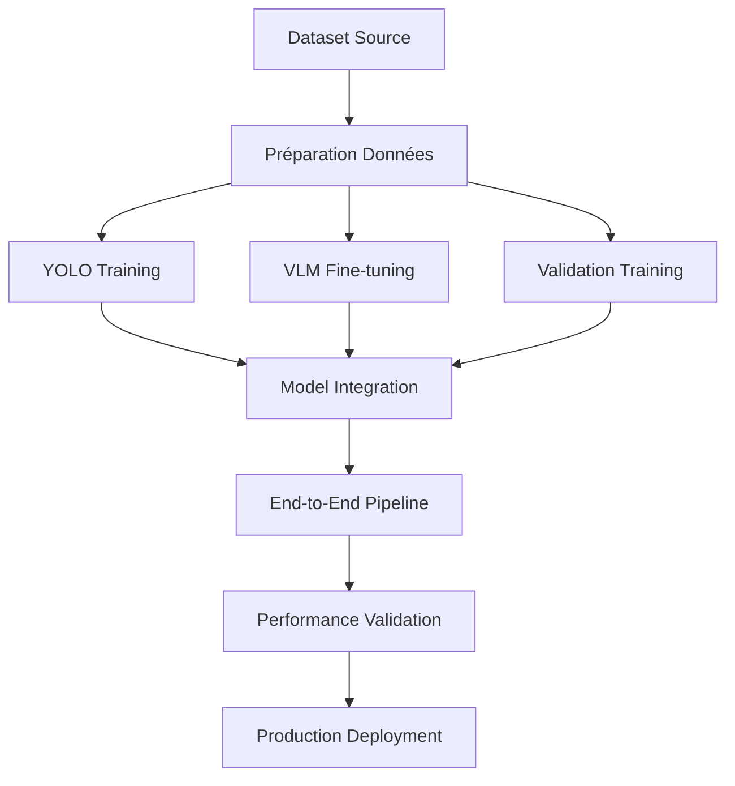

# 🎯 Méthodologies d'Entraînement - Système de Surveillance Intelligente

## 📖 Table des Matières

1. [Vue d'Ensemble](#vue-densemble)
2. [Architecture d'Entraînement](#architecture-dentraînement)
3. [Formats de Données](#formats-de-données)
4. [Fine-tuning VLM](#fine-tuning-vlm)
5. [Transfer Learning YOLO](#transfer-learning-yolo)
6. [Entraînement End-to-End](#entraînement-end-to-end)
7. [Validation Croisée](#validation-croisée)
8. [Optimisation des Performances](#optimisation-des-performances)
9. [Déploiement et Production](#déploiement-et-production)
10. [Bonnes Pratiques](#bonnes-pratiques)

---

## 🎯 Vue d'Ensemble

### Objectifs de Performance

| Métrique | Cible | Méthode de Mesure |
|----------|--------|-------------------|
| **Précision Détection** | >90% | mAP@0.5 sur dataset de validation |
| **Faux Positifs** | <3% | Taux FP après validation croisée |
| **Latence** | <1.5s | Temps de traitement par frame |
| **Streams Concurrents** | >10 | Test de charge système |
| **Disponibilité** | >99% | Monitoring temps réel |

### Composants du Système



---

## 🏗️ Architecture d'Entraînement

### 1. Pipeline Multi-Modèles

```python
# Architecture modulaire
surveillance_system = {
    'detection_layer': {
        'primary': 'YOLOv8',
        'backup': 'YOLOv5',
        'ensemble': True
    },
    'analysis_layer': {
        'vlm': 'LLaVA-NeXT-7B',
        'behavior': 'Custom Transformer',
        'validation': 'ML Ensemble'
    },
    'integration_layer': {
        'orchestrator': 'Tool Calling System',
        'monitor': 'Performance Tracker',
        'feedback': 'Adaptive Learning'
    }
}
```

### 2. Stratégie d'Entraînement

#### Phase 1: Entraînement Individuel
- **YOLO**: Transfer learning sur dataset surveillance
- **VLM**: Fine-tuning avec LoRA sur conversations
- **Validation**: ML classifiers sur features extraites

#### Phase 2: Intégration
- **Calibration**: Ajustement des seuils inter-modèles
- **Ensemble**: Optimisation des poids de combinaison
- **Pipeline**: Test end-to-end complet

#### Phase 3: Optimisation
- **Performance**: Profilage et optimisation GPU/CPU
- **Qualité**: Réduction faux positifs via validation
- **Robustesse**: Tests dans conditions variées

---

## 📊 Formats de Données

### Structure de Données Unifiée

```
data/datasets/
├── surveillance_detection/     # Dataset YOLO
│   ├── images/
│   │   ├── train/             # 80% des données
│   │   ├── val/               # 15% des données
│   │   └── test/              # 5% des données
│   ├── labels/                # Annotations YOLO
│   │   ├── train/
│   │   ├── val/
│   │   └── test/
│   └── dataset.yaml           # Configuration YOLO
├── vlm_surveillance/          # Dataset VLM
│   ├── images/                # Images pour conversations
│   ├── conversations.json     # Dialogues d'entraînement
│   └── metadata.json          # Métadonnées enrichies
├── behavior_analysis/         # Dataset comportemental
│   ├── sequences/             # Séquences temporelles
│   ├── annotations/           # Labels comportements
│   └── behaviors.json         # Définitions comportements
└── synthetic/                 # Données synthétiques
    ├── generated_scenes/      # Scènes générées
    └── augmented_data/        # Augmentations
```

### Format YOLO Surveillance

```yaml
# dataset.yaml
path: ./surveillance_detection
train: images/train
val: images/val
test: images/test

names:
  0: person
  1: handbag
  2: backpack
  3: suitcase
  4: bottle
  5: cup
  6: cell_phone
  7: book
  8: shopping_cart
  9: suspicious_object

# Classes comportementales (métadonnées)
behaviors:
  10: normal_shopping
  11: suspicious_movement
  12: item_concealment
  13: potential_theft
```

### Format Conversations VLM

```json
{
  "conversations": [
    {
      "id": "conv_001",
      "image": "store_scene_001.jpg",
      "conversations": [
        {
          "from": "human",
          "value": "Analysez cette scène de surveillance. Y a-t-il des comportements suspects ?"
        },
        {
          "from": "gpt",
          "value": "Je vois une personne dans la section électronique manipulant des produits. Son comportement semble normal - elle examine les articles de manière typique. Niveau de suspicion: FAIBLE. Actions recommandées: surveillance passive.",
          "tool_calls": [
            {
              "name": "object_detector",
              "arguments": {
                "confidence_threshold": 0.3,
                "focus_classes": ["person", "handbag"]
              }
            }
          ]
        }
      ],
      "metadata": {
        "store_zone": "electronics",
        "time_of_day": "afternoon",
        "ground_truth": "normal_shopping",
        "tools_available": ["object_detector", "tracker", "behavior_analyzer"]
      }
    }
  ]
}
```

---

## 🧠 Fine-tuning VLM

### 1. Architecture et Configuration

#### Modèle Base
```python
model_config = {
    'name': 'llava-hf/llava-v1.6-mistral-7b-hf',
    'quantization': {
        'load_in_4bit': True,
        'bnb_4bit_compute_dtype': torch.float16,
        'bnb_4bit_quant_type': 'nf4',
        'bnb_4bit_use_double_quant': True
    }
}
```

#### Configuration LoRA
```python
lora_config = {
    'r': 16,                    # Rang de décomposition
    'lora_alpha': 32,          # Facteur de scaling
    'target_modules': [         # Modules ciblés
        'q_proj', 'v_proj', 
        'k_proj', 'o_proj'
    ],
    'lora_dropout': 0.1,       # Dropout LoRA
    'bias': 'none',            # Pas de bias LoRA
    'task_type': 'CAUSAL_LM'   # Type de tâche
}
```

### 2. Stratégie d'Entraînement

#### Préparation des Données
```python
def prepare_vlm_dataset(conversations_path):
    """Prépare le dataset pour l'entraînement VLM."""
    
    # 1. Chargement et validation
    conversations = load_conversations(conversations_path)
    validate_conversations(conversations)
    
    # 2. Formatage des prompts
    formatted_data = []
    for conv in conversations:
        # Template système pour surveillance
        system_prompt = """Vous êtes un expert en analyse de surveillance. 
        Analysez les scènes avec précision et utilisez les outils appropriés."""
        
        # Formatage conversation
        conversation_text = f"System: {system_prompt}\n"
        for msg in conv['conversations']:
            role = "Human" if msg['from'] == 'human' else "Assistant"
            conversation_text += f"{role}: {msg['value']}\n"
        
        formatted_data.append({
            'text': conversation_text,
            'metadata': conv.get('metadata', {}),
            'image_path': conv.get('image', None)
        })
    
    return formatted_data

# 3. Tokenisation avec attention sur les outils
def tokenize_with_tools(examples, tokenizer):
    """Tokenisation spécialisée pour les appels d'outils."""
    
    # Tokens spéciaux pour les outils
    special_tokens = {
        '<tool_start>': tokenizer.convert_tokens_to_ids('<tool_start>'),
        '<tool_end>': tokenizer.convert_tokens_to_ids('<tool_end>'),
        '<tool_name>': tokenizer.convert_tokens_to_ids('<tool_name>'),
        '<tool_args>': tokenizer.convert_tokens_to_ids('<tool_args>')
    }
    
    tokenized = tokenizer(
        examples['text'],
        truncation=True,
        padding='max_length',
        max_length=1024,  # Séquences longues pour contexte
        return_tensors='pt'
    )
    
    return tokenized
```

#### Configuration d'Entraînement
```python
training_args = TrainingArguments(
    # Paramètres de base
    output_dir='./vlm_surveillance_model',
    num_train_epochs=3,
    per_device_train_batch_size=2,     # Petit pour économiser mémoire
    gradient_accumulation_steps=8,      # Compense petite batch
    
    # Optimisation mémoire
    fp16=True,
    gradient_checkpointing=True,
    dataloader_pin_memory=False,
    dataloader_num_workers=0,
    
    # Apprentissage adaptatif
    learning_rate=2e-4,
    warmup_steps=100,
    lr_scheduler_type='cosine',
    weight_decay=0.01,
    
    # Évaluation et sauvegarde
    evaluation_strategy='steps',
    eval_steps=100,
    save_steps=500,
    save_strategy='steps',
    load_best_model_at_end=True,
    metric_for_best_model='eval_loss',
    
    # Logging
    logging_steps=10,
    report_to=None  # Pas de logging externe pour Colab
)
```

### 3. Métriques d'Évaluation

#### Métriques Spécialisées Surveillance
```python
def evaluate_vlm_surveillance(model, eval_dataset):
    """Évaluation spécialisée pour surveillance."""
    
    metrics = {
        'perplexity': 0.0,
        'tool_calling_accuracy': 0.0,
        'suspicion_level_accuracy': 0.0,
        'response_relevance': 0.0,
        'false_alarm_rate': 0.0
    }
    
    for batch in eval_dataset:
        # Génération de réponses
        with torch.no_grad():
            outputs = model.generate(
                batch['input_ids'],
                max_length=512,
                temperature=0.7,
                do_sample=True,
                pad_token_id=tokenizer.eos_token_id
            )
        
        # Évaluation des métriques
        for i, (input_ids, target, generated) in enumerate(
            zip(batch['input_ids'], batch['labels'], outputs)
        ):
            # 1. Perplexité standard
            loss = model(input_ids.unsqueeze(0), labels=target.unsqueeze(0)).loss
            metrics['perplexity'] += torch.exp(loss).item()
            
            # 2. Précision des appels d'outils
            tool_accuracy = evaluate_tool_calls(generated, target)
            metrics['tool_calling_accuracy'] += tool_accuracy
            
            # 3. Classification niveau suspicion
            suspicion_accuracy = evaluate_suspicion_classification(generated, batch['metadata'][i])
            metrics['suspicion_level_accuracy'] += suspicion_accuracy
    
    # Moyennage
    num_samples = len(eval_dataset)
    for key in metrics:
        metrics[key] /= num_samples
    
    return metrics
```

---

## 🎯 Transfer Learning YOLO

### 1. Configuration Modèle

#### Paramètres de Base
```python
yolo_config = {
    'model': 'yolov8n.pt',      # Modèle nano pour rapidité
    'task': 'detect',           # Tâche de détection
    'mode': 'train',            # Mode entraînement
    
    # Paramètres surveillance
    'imgsz': 640,              # Taille image standard
    'epochs': 100,             # Epochs d'entraînement
    'batch': 16,               # Taille batch optimisée
    'workers': 4,              # Workers pour data loading
    
    # Optimisations
    'optimizer': 'AdamW',       # Optimiseur moderne
    'lr0': 0.01,               # Learning rate initial
    'weight_decay': 0.0005,    # Régularisation L2
    'momentum': 0.937,         # Momentum SGD
    
    # Surveillance spécifique
    'cls': 1.0,                # Poids loss classification
    'box': 7.5,                # Poids loss regression bbox
    'dfl': 1.5,                # Distribution Focal Loss
}
```

#### Classes Surveillance Optimisées
```python
surveillance_classes = {
    # Classes principales (haute priorité)
    0: {'name': 'person', 'priority': 'high', 'threshold': 0.25},
    1: {'name': 'handbag', 'priority': 'medium', 'threshold': 0.35},
    2: {'name': 'backpack', 'priority': 'medium', 'threshold': 0.35},
    
    # Classes contextuelles
    3: {'name': 'suitcase', 'priority': 'medium', 'threshold': 0.40},
    4: {'name': 'bottle', 'priority': 'low', 'threshold': 0.45},
    5: {'name': 'cup', 'priority': 'low', 'threshold': 0.50},
    
    # Classes surveillance avancée
    8: {'name': 'shopping_cart', 'priority': 'context', 'threshold': 0.30},
    9: {'name': 'suspicious_object', 'priority': 'critical', 'threshold': 0.20}
}
```

### 2. Stratégie d'Entraînement

#### Transfer Learning Progressif
```python
def progressive_transfer_learning():
    """Entraînement progressif par étapes."""
    
    # Étape 1: Freeze backbone, train head
    model = YOLO('yolov8n.pt')
    
    # Configuration étape 1
    stage1_config = {
        'epochs': 30,
        'freeze': [0, 1, 2, 3, 4, 5, 6, 7, 8, 9],  # Freeze backbone
        'lr0': 0.001,  # LR plus faible
        'patience': 15
    }
    
    results_stage1 = model.train(
        data='surveillance_dataset.yaml',
        **stage1_config
    )
    
    # Étape 2: Unfreeze partially, fine-tune
    stage2_config = {
        'epochs': 50,
        'freeze': [0, 1, 2, 3],  # Unfreeze partiellement
        'lr0': 0.0001,  # LR encore plus faible
        'patience': 20
    }
    
    results_stage2 = model.train(
        data='surveillance_dataset.yaml',
        **stage2_config
    )
    
    # Étape 3: Fine-tuning complet
    stage3_config = {
        'epochs': 70,
        'freeze': [],  # Aucun freeze
        'lr0': 0.00001,  # LR très faible
        'patience': 25
    }
    
    results_stage3 = model.train(
        data='surveillance_dataset.yaml',
        **stage3_config
    )
    
    return model, [results_stage1, results_stage2, results_stage3]
```

#### Augmentation de Données Spécialisée
```python
surveillance_augmentation = {
    # Transformations géométriques (conditions surveillance)
    'degrees': 5.0,           # Rotation limitée (caméras fixes)
    'translate': 0.1,         # Translation modérée
    'scale': 0.2,            # Variation d'échelle
    'shear': 2.0,            # Déformation perspective
    'flipud': 0.0,           # Pas de flip vertical (gravité)
    'fliplr': 0.5,           # Flip horizontal (miroirs)
    
    # Transformations photométriques (éclairage magasin)
    'hsv_h': 0.010,          # Variation teinte limitée
    'hsv_s': 0.5,            # Variation saturation
    'hsv_v': 0.3,            # Variation luminosité importante
    
    # Augmentations surveillance spécifiques
    'surveillance_lighting': {
        'artificial_light': 0.3,    # Éclairage artificiel
        'shadows': 0.2,             # Ombres portées
        'reflections': 0.1,         # Reflets vitres
        'occlusions': 0.15          # Occlusions partielles
    },
    
    # Conditions dégradées
    'noise': 0.02,           # Bruit capteur
    'blur': 0.1,             # Flou de mouvement
    'compression': 0.1       # Artéfacts compression
}
```

### 3. Optimisation Performance

#### Post-Processing Surveillance
```python
def surveillance_nms(predictions, conf_thres=0.25, iou_thres=0.45):
    """Non-Maximum Suppression optimisée surveillance."""
    
    # Seuils adaptatifs par classe
    class_thresholds = {
        0: 0.25,  # person - seuil bas (important)
        1: 0.35,  # handbag - seuil moyen
        2: 0.35,  # backpack - seuil moyen
        9: 0.20   # suspicious_object - seuil très bas
    }
    
    filtered_predictions = []
    
    for pred in predictions:
        for detection in pred:
            class_id = int(detection[5])
            confidence = detection[4]
            
            # Seuil adaptatif
            threshold = class_thresholds.get(class_id, conf_thres)
            
            if confidence >= threshold:
                # Boost de confiance pour classes critiques
                if class_id in [0, 9]:  # person, suspicious_object
                    detection[4] *= 1.1  # Boost 10%
                
                filtered_predictions.append(detection)
    
    # NMS avec IoU adaptatif
    return non_max_suppression(
        filtered_predictions, 
        conf_thres, 
        iou_thres,
        multi_label=True,
        max_det=50  # Max détections par image
    )
```

---

## 🔄 Entraînement End-to-End

### 1. Architecture Pipeline

```python
class SurveillancePipeline:
    """Pipeline d'entraînement end-to-end."""
    
    def __init__(self, config):
        self.config = config
        
        # Composants principaux
        self.yolo_detector = None
        self.vlm_analyzer = None
        self.validation_system = None
        self.performance_monitor = None
        
        # Métriques d'entraînement
        self.training_metrics = {
            'detection_accuracy': [],
            'vlm_relevance': [],
            'validation_precision': [],
            'end_to_end_latency': [],
            'false_positive_rate': []
        }
    
    def train_pipeline(self, dataset_config):
        """Entraîne le pipeline complet."""
        
        # Phase 1: Entraînement individuel des composants
        self._train_individual_components(dataset_config)
        
        # Phase 2: Calibration inter-composants
        self._calibrate_components(dataset_config['validation'])
        
        # Phase 3: Optimisation end-to-end
        self._optimize_pipeline(dataset_config['test'])
        
        return self.training_metrics
    
    def _train_individual_components(self, dataset_config):
        """Entraîne chaque composant individuellement."""
        
        # 1. YOLO Detection
        logger.info("Entraînement détecteur YOLO...")
        self.yolo_detector = self._train_yolo(
            dataset_config['yolo_data']
        )
        
        # 2. VLM Analysis
        logger.info("Fine-tuning VLM...")
        self.vlm_analyzer = self._train_vlm(
            dataset_config['vlm_data']
        )
        
        # 3. Validation System
        logger.info("Entraînement système validation...")
        self.validation_system = self._train_validation(
            dataset_config['validation_data']
        )
    
    def _calibrate_components(self, validation_data):
        """Calibre les seuils entre composants."""
        
        calibration_metrics = {
            'detection_thresholds': {},
            'vlm_confidence_mapping': {},
            'validation_weights': {}
        }
        
        # Analyse des performances croisées
        for sample in validation_data:
            # Détection YOLO
            detections = self.yolo_detector(sample['image'])
            
            # Analyse VLM
            vlm_analysis = self.vlm_analyzer(sample['image'], detections)
            
            # Validation croisée
            validation_result = self.validation_system(
                sample['image'], detections, vlm_analysis
            )
            
            # Ajustement des seuils
            self._update_thresholds(
                sample['ground_truth'], 
                detections, 
                vlm_analysis, 
                validation_result,
                calibration_metrics
            )
        
        # Application des seuils optimaux
        self._apply_calibrated_thresholds(calibration_metrics)
    
    def _optimize_pipeline(self, test_data):
        """Optimise le pipeline end-to-end."""
        
        optimization_config = {
            'target_latency': 1.5,      # secondes
            'target_fps': 15,           # frames par seconde
            'target_accuracy': 0.90,    # précision minimale
            'target_fp_rate': 0.03      # taux faux positifs max
        }
        
        # Optimisation par recherche de grille
        param_grid = {
            'detection_batch_size': [4, 8, 16],
            'vlm_context_length': [256, 512, 1024],
            'validation_ensemble_size': [3, 5, 7]
        }
        
        best_config = self._grid_search_optimization(
            param_grid, test_data, optimization_config
        )
        
        # Application de la configuration optimale
        self._apply_optimal_config(best_config)
```

### 2. Métriques d'Évaluation End-to-End

```python
def evaluate_end_to_end_performance(pipeline, test_dataset):
    """Évalue les performances end-to-end."""
    
    metrics = {
        # Métriques de détection
        'detection': {
            'mAP50': 0.0,
            'mAP50_95': 0.0,
            'precision': 0.0,
            'recall': 0.0,
            'f1_score': 0.0
        },
        
        # Métriques VLM
        'vlm': {
            'relevance_score': 0.0,
            'tool_calling_accuracy': 0.0,
            'suspicion_classification': 0.0,
            'response_coherence': 0.0
        },
        
        # Métriques système
        'system': {
            'end_to_end_latency': 0.0,
            'throughput_fps': 0.0,
            'memory_usage_gb': 0.0,
            'cpu_utilization': 0.0,
            'gpu_utilization': 0.0
        },
        
        # Métriques surveillance
        'surveillance': {
            'false_positive_rate': 0.0,
            'true_positive_rate': 0.0,
            'alert_precision': 0.0,
            'alert_recall': 0.0,
            'response_time': 0.0
        }
    }
    
    total_samples = len(test_dataset)
    start_time = time.time()
    
    for i, sample in enumerate(test_dataset):
        # Traitement complet
        sample_start = time.time()
        
        # 1. Détection
        detections = pipeline.detect(sample['image'])
        
        # 2. Analyse VLM
        vlm_result = pipeline.analyze(sample['image'], detections)
        
        # 3. Validation
        final_result = pipeline.validate(
            sample['image'], detections, vlm_result
        )
        
        sample_latency = time.time() - sample_start
        
        # Calcul des métriques pour ce sample
        sample_metrics = calculate_sample_metrics(
            sample['ground_truth'], 
            final_result, 
            sample_latency
        )
        
        # Accumulation
        for category in metrics:
            for metric in metrics[category]:
                metrics[category][metric] += sample_metrics[category][metric]
    
    # Moyennage
    total_time = time.time() - start_time
    
    for category in metrics:
        for metric in metrics[category]:
            metrics[category][metric] /= total_samples
    
    # Métriques globales
    metrics['system']['throughput_fps'] = total_samples / total_time
    metrics['system']['average_pipeline_latency'] = total_time / total_samples
    
    return metrics
```

---

## ✅ Validation Croisée

### 1. Architecture Multi-Niveau

```python
class MultiLevelValidator:
    """Système de validation multi-niveau."""
    
    def __init__(self):
        self.validation_levels = {
            'BASIC': BasicValidator(),
            'INTERMEDIATE': IntermediateValidator(), 
            'ADVANCED': AdvancedValidator(),
            'CRITICAL': CriticalValidator()
        }
        
        self.ml_models = {
            'random_forest': None,
            'gradient_boosting': None,
            'neural_network': None
        }
        
        self.validation_rules = [
            ConfidenceThresholdRule(),
            TemporalConsistencyRule(),
            SpatialCoherenceRule(),
            BehaviorAnalysisRule(),
            ContextualValidationRule(),
            MultiModelAgreementRule(),
            FalsePositivePredictionRule()
        ]
    
    def validate_detection(self, frame, detections, context=None):
        """Valide une détection avec approche multi-niveau."""
        
        validation_result = {
            'is_valid': True,
            'confidence_score': 1.0,
            'validation_level': 'BASIC',
            'applied_rules': [],
            'ml_predictions': {},
            'reasoning': []
        }
        
        # Extraction des features
        features = self._extract_validation_features(
            frame, detections, context
        )
        
        # Application des règles par niveau
        for level_name, validator in self.validation_levels.items():
            level_result = validator.validate(features, detections)
            
            if not level_result['passed']:
                validation_result['is_valid'] = False
                validation_result['confidence_score'] = level_result['confidence']
                validation_result['validation_level'] = level_name
                validation_result['reasoning'].extend(level_result['reasons'])
                break
            
            validation_result['applied_rules'].extend(level_result['rules_applied'])
        
        # Validation ML (ensemble)
        if validation_result['is_valid']:
            ml_validation = self._ml_ensemble_validation(features)
            validation_result['ml_predictions'] = ml_validation
            
            # Si ML prédit faux positif avec forte confiance
            if ml_validation['false_positive_probability'] > 0.7:
                validation_result['is_valid'] = False
                validation_result['confidence_score'] = 1 - ml_validation['false_positive_probability']
                validation_result['reasoning'].append("ML ensemble predicts false positive")
        
        return validation_result
    
    def _extract_validation_features(self, frame, detections, context):
        """Extrait les features pour la validation."""
        
        features = {
            # Features de détection
            'detection_features': [],
            # Features temporelles
            'temporal_features': [],
            # Features contextuelles
            'contextual_features': [],
            # Features comportementales
            'behavioral_features': []
        }
        
        for detection in detections:
            det_features = {
                # Métriques de base
                'confidence': detection.confidence,
                'bbox_area': detection.bbox.area_normalized(),
                'bbox_aspect_ratio': detection.bbox.aspect_ratio(),
                'bbox_center_distance': detection.bbox.center_distance_from_image_center(),
                
                # Métriques qualité
                'edge_sharpness': self._calculate_edge_sharpness(frame, detection.bbox),
                'color_consistency': self._calculate_color_consistency(frame, detection.bbox),
                'texture_complexity': self._calculate_texture_complexity(frame, detection.bbox),
                
                # Métriques contextuelles
                'scene_coherence': self._calculate_scene_coherence(detection, context),
                'size_realism': self._calculate_size_realism(detection, frame),
                'position_probability': self._calculate_position_probability(detection, context)
            }
            
            features['detection_features'].append(det_features)
        
        return features
```

### 2. Règles de Validation Spécialisées

```python
class ConfidenceThresholdRule:
    """Règle basée sur les seuils de confiance adaptatifs."""
    
    def __init__(self):
        self.class_thresholds = {
            'person': 0.25,
            'handbag': 0.35,
            'backpack': 0.35,
            'suspicious_object': 0.20
        }
        
        self.dynamic_adjustment = True
        self.context_modifiers = {
            'low_light': -0.05,
            'crowded': -0.03,
            'high_quality': +0.02
        }
    
    def validate(self, features, detections):
        """Applique la validation par seuils."""
        
        result = {
            'passed': True,
            'confidence': 1.0,
            'reasons': [],
            'rules_applied': ['confidence_threshold']
        }
        
        for i, detection in enumerate(detections):
            det_features = features['detection_features'][i]
            base_threshold = self.class_thresholds.get(
                detection.class_name, 0.40
            )
            
            # Ajustement contextuel
            adjusted_threshold = base_threshold
            for context, modifier in self.context_modifiers.items():
                if context in features.get('contextual_features', {}):
                    adjusted_threshold += modifier
            
            if det_features['confidence'] < adjusted_threshold:
                result['passed'] = False
                result['confidence'] = det_features['confidence'] / adjusted_threshold
                result['reasons'].append(
                    f"Confidence {det_features['confidence']:.3f} below threshold {adjusted_threshold:.3f}"
                )
        
        return result


class TemporalConsistencyRule:
    """Règle de cohérence temporelle."""
    
    def __init__(self):
        self.track_history = {}
        self.min_track_length = 3
        self.max_velocity_change = 0.1
        self.max_size_change = 0.2
    
    def validate(self, features, detections):
        """Valide la cohérence temporelle des détections."""
        
        result = {
            'passed': True,
            'confidence': 1.0,
            'reasons': [],
            'rules_applied': ['temporal_consistency']
        }
        
        current_time = time.time()
        
        for detection in detections:
            track_id = getattr(detection, 'track_id', None)
            if track_id is None:
                continue
            
            # Initialisation du track
            if track_id not in self.track_history:
                self.track_history[track_id] = []
            
            # Ajout de l'observation actuelle
            observation = {
                'timestamp': current_time,
                'bbox': detection.bbox,
                'confidence': detection.confidence,
                'position': detection.bbox.center()
            }
            
            self.track_history[track_id].append(observation)
            
            # Nettoyage ancien historique (>30s)
            self.track_history[track_id] = [
                obs for obs in self.track_history[track_id]
                if current_time - obs['timestamp'] < 30
            ]
            
            # Validation si assez d'historique
            if len(self.track_history[track_id]) >= self.min_track_length:
                consistency_score = self._calculate_consistency(
                    self.track_history[track_id]
                )
                
                if consistency_score < 0.7:
                    result['passed'] = False
                    result['confidence'] = consistency_score
                    result['reasons'].append(
                        f"Low temporal consistency: {consistency_score:.3f}"
                    )
        
        return result
    
    def _calculate_consistency(self, track_history):
        """Calcule le score de cohérence temporelle."""
        
        if len(track_history) < 2:
            return 1.0
        
        velocities = []
        size_changes = []
        
        for i in range(1, len(track_history)):
            prev_obs = track_history[i-1]
            curr_obs = track_history[i]
            
            # Calcul de la vélocité
            dt = curr_obs['timestamp'] - prev_obs['timestamp']
            if dt > 0:
                dx = curr_obs['position'][0] - prev_obs['position'][0]
                dy = curr_obs['position'][1] - prev_obs['position'][1]
                velocity = np.sqrt(dx**2 + dy**2) / dt
                velocities.append(velocity)
            
            # Changement de taille
            prev_area = prev_obs['bbox'].area()
            curr_area = curr_obs['bbox'].area()
            if prev_area > 0:
                size_change = abs(curr_area - prev_area) / prev_area
                size_changes.append(size_change)
        
        # Score basé sur la variation des métriques
        velocity_consistency = 1.0
        if velocities:
            velocity_std = np.std(velocities)
            velocity_consistency = max(0, 1 - velocity_std / self.max_velocity_change)
        
        size_consistency = 1.0
        if size_changes:
            size_std = np.std(size_changes)
            size_consistency = max(0, 1 - size_std / self.max_size_change)
        
        return min(velocity_consistency, size_consistency)
```

---

## ⚡ Optimisation des Performances

### 1. Optimisation GPU/CPU

```python
class PerformanceOptimizer:
    """Optimiseur de performances système."""
    
    def __init__(self):
        self.gpu_available = torch.cuda.is_available()
        self.device_info = self._get_device_info()
        self.optimization_config = self._get_optimization_config()
    
    def optimize_models(self, yolo_model, vlm_model):
        """Optimise les modèles pour les performances."""
        
        optimizations_applied = []
        
        # 1. Optimisation YOLO
        yolo_optimized = self._optimize_yolo(yolo_model)
        optimizations_applied.extend(yolo_optimized['optimizations'])
        
        # 2. Optimisation VLM
        vlm_optimized = self._optimize_vlm(vlm_model)
        optimizations_applied.extend(vlm_optimized['optimizations'])
        
        # 3. Optimisation mémoire
        memory_optimized = self._optimize_memory()
        optimizations_applied.extend(memory_optimized['optimizations'])
        
        return {
            'yolo_model': yolo_optimized['model'],
            'vlm_model': vlm_optimized['model'],
            'optimizations': optimizations_applied,
            'expected_speedup': self._calculate_expected_speedup(optimizations_applied)
        }
    
    def _optimize_yolo(self, model):
        """Optimisations spécifiques YOLO."""
        
        optimizations = []
        
        # 1. TensorRT (si GPU NVIDIA)
        if self.gpu_available and 'nvidia' in self.device_info['gpu_name'].lower():
            try:
                trt_model = model.export(format='engine', half=True)
                optimizations.append('tensorrt_fp16')
                model = trt_model
            except Exception as e:
                logger.warning(f"TensorRT optimization failed: {e}")
        
        # 2. ONNX optimisation
        try:
            onnx_model = model.export(format='onnx', optimize=True)
            optimizations.append('onnx_optimized')
        except Exception as e:
            logger.warning(f"ONNX optimization failed: {e}")
        
        # 3. Quantification
        if hasattr(model, 'fuse'):
            model.fuse()
            optimizations.append('layer_fusion')
        
        # 4. Batch processing optimisation
        model.batch_size = self.optimization_config['optimal_batch_size']
        optimizations.append('batch_optimization')
        
        return {
            'model': model,
            'optimizations': optimizations
        }
    
    def _optimize_vlm(self, model):
        """Optimisations spécifiques VLM."""
        
        optimizations = []
        
        # 1. Attention optimization
        if hasattr(model, 'config'):
            # Flash Attention si disponible
            try:
                model.config.use_flash_attention_2 = True
                optimizations.append('flash_attention')
            except:
                pass
            
            # Gradient checkpointing
            model.gradient_checkpointing_enable()
            optimizations.append('gradient_checkpointing')
        
        # 2. KV-Cache optimization
        model.config.use_cache = True
        optimizations.append('kv_cache')
        
        # 3. Mixed precision
        if self.gpu_available:
            model = model.half()
            optimizations.append('mixed_precision_fp16')
        
        return {
            'model': model,
            'optimizations': optimizations
        }
    
    def _get_optimization_config(self):
        """Détermine la configuration optimale selon le hardware."""
        
        config = {
            'optimal_batch_size': 8,
            'max_sequence_length': 512,
            'use_mixed_precision': True,
            'enable_attention_optimization': True
        }
        
        if self.gpu_available:
            gpu_memory_gb = torch.cuda.get_device_properties(0).total_memory / 1e9
            
            if gpu_memory_gb >= 24:  # A100, RTX 6000
                config.update({
                    'optimal_batch_size': 16,
                    'max_sequence_length': 1024,
                    'enable_tensorrt': True
                })
            elif gpu_memory_gb >= 12:  # RTX 4090, Tesla V100
                config.update({
                    'optimal_batch_size': 12,
                    'max_sequence_length': 768,
                    'enable_tensorrt': True
                })
            elif gpu_memory_gb >= 8:  # RTX 4070, T4
                config.update({
                    'optimal_batch_size': 8,
                    'max_sequence_length': 512,
                    'enable_quantization': True
                })
            else:  # GPU < 8GB
                config.update({
                    'optimal_batch_size': 4,
                    'max_sequence_length': 256,
                    'enable_quantization': True,
                    'use_cpu_fallback': True
                })
        else:
            # Configuration CPU
            config.update({
                'optimal_batch_size': 2,
                'max_sequence_length': 256,
                'use_mixed_precision': False,
                'enable_onnx_optimization': True
            })
        
        return config
```

### 2. Profilage et Monitoring

```python
class PerformanceProfiler:
    """Profileur de performances en temps réel."""
    
    def __init__(self):
        self.metrics_history = defaultdict(list)
        self.alert_thresholds = {
            'latency_ms': 1500,      # 1.5s max
            'memory_gb': 16,         # 16GB max
            'gpu_utilization': 95,   # 95% max
            'fps': 10                # 10 FPS min
        }
        
        self.monitoring_active = False
        self.profile_thread = None
    
    def start_monitoring(self, pipeline):
        """Démarre le monitoring en continu."""
        
        self.monitoring_active = True
        self.profile_thread = threading.Thread(
            target=self._monitor_loop,
            args=(pipeline,)
        )
        self.profile_thread.start()
    
    def _monitor_loop(self, pipeline):
        """Boucle de monitoring principal."""
        
        while self.monitoring_active:
            try:
                # Collecte des métriques
                metrics = self._collect_metrics(pipeline)
                
                # Mise à jour historique
                for metric_name, value in metrics.items():
                    self.metrics_history[metric_name].append({
                        'timestamp': time.time(),
                        'value': value
                    })
                    
                    # Nettoyage historique (garder 1h)
                    cutoff_time = time.time() - 3600
                    self.metrics_history[metric_name] = [
                        entry for entry in self.metrics_history[metric_name]
                        if entry['timestamp'] > cutoff_time
                    ]
                
                # Vérification des seuils
                alerts = self._check_alerts(metrics)
                if alerts:
                    self._handle_alerts(alerts, pipeline)
                
                time.sleep(1)  # Monitoring chaque seconde
                
            except Exception as e:
                logger.error(f"Erreur monitoring: {e}")
    
    def _collect_metrics(self, pipeline):
        """Collecte les métriques système."""
        
        metrics = {}
        
        # Métriques système
        import psutil
        
        metrics['cpu_percent'] = psutil.cpu_percent()
        metrics['memory_gb'] = psutil.virtual_memory().used / 1e9
        metrics['memory_percent'] = psutil.virtual_memory().percent
        
        # Métriques GPU
        if torch.cuda.is_available():
            metrics['gpu_memory_gb'] = torch.cuda.memory_allocated() / 1e9
            metrics['gpu_memory_percent'] = (
                torch.cuda.memory_allocated() / 
                torch.cuda.max_memory_allocated() * 100
            )
            
            try:
                import pynvml
                pynvml.nvmlInit()
                handle = pynvml.nvmlDeviceGetHandleByIndex(0)
                gpu_util = pynvml.nvmlDeviceGetUtilizationRates(handle)
                metrics['gpu_utilization'] = gpu_util.gpu
            except:
                pass
        
        # Métriques pipeline
        if hasattr(pipeline, 'performance_stats'):
            stats = pipeline.performance_stats
            metrics['pipeline_latency_ms'] = stats.get('avg_latency', 0) * 1000
            metrics['pipeline_fps'] = stats.get('fps', 0)
            metrics['detection_count'] = stats.get('total_detections', 0)
            metrics['alert_rate'] = stats.get('alert_rate', 0)
        
        return metrics
    
    def _check_alerts(self, metrics):
        """Vérifie les dépassements de seuils."""
        
        alerts = []
        
        for metric_name, threshold in self.alert_thresholds.items():
            if metric_name in metrics:
                value = metrics[metric_name]
                
                if metric_name == 'fps':
                    # FPS: alerte si en dessous du seuil
                    if value < threshold:
                        alerts.append({
                            'type': 'low_fps',
                            'metric': metric_name,
                            'value': value,
                            'threshold': threshold,
                            'severity': 'warning'
                        })
                else:
                    # Autres métriques: alerte si au-dessus
                    if value > threshold:
                        severity = 'critical' if value > threshold * 1.2 else 'warning'
                        alerts.append({
                            'type': 'threshold_exceeded',
                            'metric': metric_name,
                            'value': value,
                            'threshold': threshold,
                            'severity': severity
                        })
        
        return alerts
    
    def generate_performance_report(self):
        """Génère un rapport de performance détaillé."""
        
        report = {
            'timestamp': datetime.now().isoformat(),
            'monitoring_duration': len(self.metrics_history.get('cpu_percent', [])),
            'summary': {},
            'trends': {},
            'recommendations': []
        }
        
        # Calcul des statistiques par métrique
        for metric_name, history in self.metrics_history.items():
            if not history:
                continue
            
            values = [entry['value'] for entry in history]
            
            report['summary'][metric_name] = {
                'current': values[-1] if values else 0,
                'average': np.mean(values),
                'min': np.min(values),
                'max': np.max(values),
                'std': np.std(values)
            }
            
            # Calcul de tendance (régression lineare simple)
            if len(values) > 10:
                x = np.arange(len(values))
                slope = np.polyfit(x, values, 1)[0]
                report['trends'][metric_name] = {
                    'slope': slope,
                    'direction': 'increasing' if slope > 0 else 'decreasing',
                    'magnitude': abs(slope)
                }
        
        # Génération de recommandations
        report['recommendations'] = self._generate_recommendations(report)
        
        return report
    
    def _generate_recommendations(self, report):
        """Génère des recommandations d'optimisation."""
        
        recommendations = []
        
        # Analyse mémoire
        if 'memory_percent' in report['summary']:
            avg_memory = report['summary']['memory_percent']['average']
            if avg_memory > 80:
                recommendations.append({
                    'type': 'memory_optimization',
                    'priority': 'high',
                    'description': 'Mémoire élevée détectée',
                    'actions': [
                        'Réduire la taille des batchs',
                        'Activer le gradient checkpointing',
                        'Optimiser la gestion du cache'
                    ]
                })
        
        # Analyse GPU
        if 'gpu_utilization' in report['summary']:
            avg_gpu = report['summary']['gpu_utilization']['average']
            if avg_gpu < 50:
                recommendations.append({
                    'type': 'gpu_underutilization',
                    'priority': 'medium', 
                    'description': 'Sous-utilisation GPU détectée',
                    'actions': [
                        'Augmenter la taille des batchs',
                        'Optimiser les transferts CPU-GPU',
                        'Paralléliser davantage les calculs'
                    ]
                })
        
        # Analyse latence
        if 'pipeline_latency_ms' in report['summary']:
            avg_latency = report['summary']['pipeline_latency_ms']['average']
            if avg_latency > 1200:  # > 1.2s
                recommendations.append({
                    'type': 'latency_optimization',
                    'priority': 'critical',
                    'description': 'Latence élevée détectée',
                    'actions': [
                        'Optimiser les modèles (TensorRT, ONNX)',
                        'Réduire la résolution des images',
                        'Implémenter le processing asynchrone'
                    ]
                })
        
        return recommendations
```

---

## 🚀 Déploiement et Production

### 1. Pipeline de Déploiement

```python
class ProductionDeploymentManager:
    """Gestionnaire de déploiement en production."""
    
    def __init__(self, config):
        self.config = config
        self.deployment_stages = [
            'model_validation',
            'performance_testing',
            'integration_testing',
            'staging_deployment',
            'production_deployment',
            'monitoring_setup'
        ]
    
    def deploy_pipeline(self, models, target_environment):
        """Déploie le pipeline en production."""
        
        deployment_log = {
            'timestamp': datetime.now().isoformat(),
            'target_environment': target_environment,
            'stages_completed': [],
            'performance_metrics': {},
            'rollback_plan': {}
        }
        
        try:
            for stage in self.deployment_stages:
                logger.info(f"Exécution stage: {stage}")
                
                stage_result = getattr(self, f'_execute_{stage}')(
                    models, target_environment
                )
                
                deployment_log['stages_completed'].append({
                    'stage': stage,
                    'status': 'success',
                    'result': stage_result,
                    'timestamp': datetime.now().isoformat()
                })
                
                # Validation critique avant production
                if stage == 'performance_testing':
                    if not self._validate_performance_requirements(stage_result):
                        raise DeploymentError("Performance requirements not met")
            
            logger.info("Déploiement réussi")
            return deployment_log
            
        except Exception as e:
            logger.error(f"Erreur déploiement: {e}")
            
            # Rollback automatique
            self._execute_rollback(deployment_log)
            raise
    
    def _execute_model_validation(self, models, environment):
        """Valide les modèles avant déploiement."""
        
        validation_results = {}
        
        # 1. Validation technique
        for model_name, model in models.items():
            model_validation = {
                'format_compatibility': self._check_model_format(model, environment),
                'dependency_check': self._check_dependencies(model, environment),
                'memory_requirements': self._check_memory_requirements(model),
                'performance_baseline': self._benchmark_model(model)
            }
            
            validation_results[model_name] = model_validation
        
        # 2. Validation fonctionnelle
        functional_tests = self._run_functional_tests(models)
        validation_results['functional'] = functional_tests
        
        # 3. Tests de sécurité
        security_tests = self._run_security_tests(models)
        validation_results['security'] = security_tests
        
        return validation_results
    
    def _execute_performance_testing(self, models, environment):
        """Tests de performance sous charge."""
        
        test_scenarios = [
            {
                'name': 'single_stream_baseline',
                'streams': 1,
                'duration': 300,  # 5 minutes
                'target_fps': 15
            },
            {
                'name': 'multi_stream_load',
                'streams': 5,
                'duration': 600,  # 10 minutes
                'target_fps': 12
            },
            {
                'name': 'stress_test',
                'streams': 10,
                'duration': 300,  # 5 minutes
                'target_fps': 8
            },
            {
                'name': 'endurance_test',
                'streams': 3,
                'duration': 3600,  # 1 heure
                'target_fps': 15
            }
        ]
        
        performance_results = {}
        
        for scenario in test_scenarios:
            logger.info(f"Exécution scenario: {scenario['name']}")
            
            scenario_result = self._run_performance_scenario(
                models, scenario, environment
            )
            
            performance_results[scenario['name']] = scenario_result
        
        return performance_results
    
    def _execute_production_deployment(self, models, environment):
        """Déploiement en production avec blue-green."""
        
        deployment_strategy = {
            'type': 'blue_green',
            'rollout_percentage': 10,  # Commencer par 10%
            'health_check_interval': 30,
            'success_criteria': {
                'error_rate': 0.01,
                'latency_p95': 2000,  # ms
                'availability': 0.999
            }
        }
        
        # 1. Préparation environnement Green
        green_environment = self._prepare_green_environment(models, environment)
        
        # 2. Déploiement graduel
        for percentage in [10, 25, 50, 100]:
            logger.info(f"Déploiement {percentage}% trafic sur Green")
            
            self._route_traffic(percentage, green_environment)
            
            # Surveillance pendant 10 minutes
            monitoring_result = self._monitor_deployment_health(
                duration=600,  # 10 minutes
                criteria=deployment_strategy['success_criteria']
            )
            
            if not monitoring_result['healthy']:
                logger.error("Problème détecté, rollback")
                self._route_traffic(0, green_environment)
                raise DeploymentError(f"Health check failed at {percentage}%")
            
            time.sleep(120)  # Attente 2 minutes entre étapes
        
        # 3. Finalisation
        self._finalize_deployment(green_environment)
        
        return {
            'green_environment': green_environment,
            'deployment_strategy': deployment_strategy,
            'final_health_check': monitoring_result
        }
```

### 2. Configuration Production

```yaml
# production_config.yaml
production:
  infrastructure:
    kubernetes:
      cluster_name: "surveillance-cluster"
      namespace: "surveillance-system"
      replicas: 3
      resources:
        requests:
          cpu: "2"
          memory: "8Gi"
          nvidia.com/gpu: "1"
        limits:
          cpu: "4"
          memory: "16Gi"
          nvidia.com/gpu: "1"
    
    load_balancer:
      type: "nginx"
      health_check: "/health"
      timeout: "30s"
      max_connections: 1000
    
    storage:
      type: "persistent_volume"
      size: "100Gi"
      access_mode: "ReadWriteOnce"
  
  models:
    yolo:
      format: "tensorrt"
      precision: "fp16"
      batch_size: 8
      warmup_iterations: 100
    
    vlm:
      format: "onnx"
      precision: "fp16"
      max_sequence_length: 512
      use_kv_cache: true
    
    validation:
      ensemble_models: ["random_forest", "gradient_boosting"]
      decision_threshold: 0.7
  
  monitoring:
    metrics:
      - name: "request_latency"
        target: "< 1.5s"
        alert_threshold: "2.0s"
      
      - name: "error_rate"
        target: "< 1%"
        alert_threshold: "2%"
      
      - name: "gpu_utilization"
        target: "60-90%"
        alert_threshold: "> 95%"
    
    logging:
      level: "INFO"
      format: "json"
      retention: "30d"
    
    alerting:
      channels: ["slack", "email", "pagerduty"]
      escalation_policy: "surveillance_team"

  security:
    authentication:
      type: "jwt"
      expiry: "24h"
    
    authorization:
      rbac_enabled: true
      roles:
        - name: "viewer"
          permissions: ["read"]
        - name: "operator"
          permissions: ["read", "acknowledge"]
        - name: "admin"
          permissions: ["read", "write", "admin"]
    
    network:
      tls_enabled: true
      cert_manager: "letsencrypt"
      firewall_rules:
        - port: 8080
          protocol: "https"
          source: "internal"

  data:
    retention:
      raw_video: "7d"
      alerts: "90d"
      metrics: "1y"
    
    backup:
      frequency: "daily"
      retention: "30d"
      destination: "s3://surveillance-backups"
    
    privacy:
      face_blurring: true
      data_anonymization: true
      gdpr_compliance: true
```

---

## 🎯 Bonnes Pratiques

### 1. Qualité des Données

#### Validation de Dataset
```python
def validate_dataset_quality(dataset_path):
    """Validation complète de la qualité du dataset."""
    
    quality_report = {
        'image_quality': {},
        'annotation_quality': {},
        'dataset_balance': {},
        'recommendations': []
    }
    
    # 1. Qualité des images
    image_metrics = analyze_image_quality(dataset_path)
    quality_report['image_quality'] = image_metrics
    
    # 2. Qualité des annotations
    annotation_metrics = analyze_annotation_quality(dataset_path)
    quality_report['annotation_quality'] = annotation_metrics
    
    # 3. Équilibrage du dataset
    balance_metrics = analyze_dataset_balance(dataset_path)
    quality_report['dataset_balance'] = balance_metrics
    
    # 4. Génération de recommandations
    recommendations = generate_quality_recommendations(quality_report)
    quality_report['recommendations'] = recommendations
    
    return quality_report

def analyze_image_quality(dataset_path):
    """Analyse la qualité technique des images."""
    
    metrics = {
        'resolution_distribution': {},
        'brightness_distribution': {},
        'contrast_distribution': {},
        'blur_detection': {},
        'noise_levels': {}
    }
    
    # Analyse automatisée de qualité
    for image_path in glob(f"{dataset_path}/**/*.jpg", recursive=True):
        img = cv2.imread(image_path)
        
        # Résolution
        h, w = img.shape[:2]
        resolution_key = f"{w}x{h}"
        metrics['resolution_distribution'][resolution_key] = \
            metrics['resolution_distribution'].get(resolution_key, 0) + 1
        
        # Luminosité moyenne
        brightness = np.mean(cv2.cvtColor(img, cv2.COLOR_BGR2GRAY))
        brightness_bin = int(brightness // 32) * 32  # Bins de 32
        metrics['brightness_distribution'][brightness_bin] = \
            metrics['brightness_distribution'].get(brightness_bin, 0) + 1
        
        # Contraste (écart-type des pixels)
        gray = cv2.cvtColor(img, cv2.COLOR_BGR2GRAY)
        contrast = np.std(gray)
        contrast_bin = int(contrast // 10) * 10
        metrics['contrast_distribution'][contrast_bin] = \
            metrics['contrast_distribution'].get(contrast_bin, 0) + 1
        
        # Détection de flou (variance du Laplacian)
        blur_score = cv2.Laplacian(gray, cv2.CV_64F).var()
        if blur_score < 100:
            metrics['blur_detection']['blurry'] = \
                metrics['blur_detection'].get('blurry', 0) + 1
        else:
            metrics['blur_detection']['sharp'] = \
                metrics['blur_detection'].get('sharp', 0) + 1
    
    return metrics
```

#### Standards d'Annotation
```python
class AnnotationStandards:
    """Standards et validation pour les annotations."""
    
    def __init__(self):
        self.standards = {
            'bbox_quality': {
                'min_area': 0.001,        # 0.1% de l'image
                'max_area': 0.8,          # 80% de l'image
                'aspect_ratio_range': (0.1, 10.0),
                'edge_tolerance': 5       # pixels
            },
            
            'class_consistency': {
                'required_attributes': {
                    'person': ['age_group', 'pose'],
                    'handbag': ['color', 'size'],
                    'backpack': ['color', 'fullness']
                },
                'mutual_exclusions': [
                    ['person', 'suspicious_object'],  # Une personne ne peut pas être un objet suspect
                ],
                'co_occurrence_rules': [
                    ('person', 'handbag', 0.3),  # 30% de personnes avec sac
                    ('person', 'backpack', 0.2)  # 20% avec sac à dos
                ]
            },
            
            'temporal_consistency': {
                'max_position_change': 0.1,   # Max 10% mouvement par frame
                'max_size_change': 0.05,      # Max 5% changement taille
                'track_continuity': 0.95      # 95% continuité de track
            }
        }
    
    def validate_annotations(self, annotations_path):
        """Valide les annotations selon les standards."""
        
        validation_results = {
            'bbox_violations': [],
            'class_inconsistencies': [],
            'temporal_violations': [],
            'overall_score': 0.0
        }
        
        annotations = load_annotations(annotations_path)
        
        for annotation in annotations:
            # Validation des bounding boxes
            bbox_issues = self._validate_bbox(annotation)
            validation_results['bbox_violations'].extend(bbox_issues)
            
            # Validation de cohérence des classes
            class_issues = self._validate_class_consistency(annotation)
            validation_results['class_inconsistencies'].extend(class_issues)
        
        # Calcul du score global
        total_annotations = len(annotations)
        total_violations = (
            len(validation_results['bbox_violations']) +
            len(validation_results['class_inconsistencies']) +
            len(validation_results['temporal_violations'])
        )
        
        validation_results['overall_score'] = max(
            0, 1 - (total_violations / max(total_annotations, 1))
        )
        
        return validation_results
```

### 2. Versioning et Reproductibilité

#### Gestion des Versions Modèles
```python
class ModelVersionManager:
    """Gestionnaire de versions pour les modèles."""
    
    def __init__(self, registry_path="./model_registry"):
        self.registry_path = Path(registry_path)
        self.registry_path.mkdir(exist_ok=True)
        
        self.version_schema = {
            'major': 0,  # Breaking changes
            'minor': 0,  # New features
            'patch': 0   # Bug fixes
        }
    
    def register_model(self, model, model_name, version=None, metadata=None):
        """Enregistre une nouvelle version de modèle."""
        
        if version is None:
            version = self._get_next_version(model_name)
        
        version_info = {
            'model_name': model_name,
            'version': version,
            'timestamp': datetime.now().isoformat(),
            'metadata': metadata or {},
            'performance_metrics': {},
            'training_config': {},
            'dataset_info': {}
        }
        
        # Création du répertoire de version
        version_path = self.registry_path / model_name / version
        version_path.mkdir(parents=True, exist_ok=True)
        
        # Sauvegarde du modèle
        model_path = version_path / "model.pth"
        torch.save(model.state_dict(), model_path)
        
        # Sauvegarde des métadonnées
        metadata_path = version_path / "version_info.json"
        with open(metadata_path, 'w') as f:
            json.dump(version_info, f, indent=2)
        
        logger.info(f"Modèle {model_name} v{version} enregistré")
        
        return version_info
    
    def load_model(self, model_class, model_name, version="latest"):
        """Charge une version spécifique du modèle."""
        
        if version == "latest":
            version = self._get_latest_version(model_name)
        
        version_path = self.registry_path / model_name / version
        
        if not version_path.exists():
            raise ValueError(f"Version {version} du modèle {model_name} introuvable")
        
        # Chargement du modèle
        model_path = version_path / "model.pth"
        model = model_class()
        model.load_state_dict(torch.load(model_path))
        
        # Chargement des métadonnées
        metadata_path = version_path / "version_info.json"
        with open(metadata_path, 'r') as f:
            version_info = json.load(f)
        
        return model, version_info
    
    def compare_versions(self, model_name, version1, version2):
        """Compare deux versions d'un modèle."""
        
        # Chargement des métadonnées
        v1_info = self._load_version_info(model_name, version1)
        v2_info = self._load_version_info(model_name, version2)
        
        comparison = {
            'version_1': version1,
            'version_2': version2,
            'performance_diff': {},
            'config_diff': {},
            'recommendations': []
        }
        
        # Comparaison des performances
        v1_metrics = v1_info.get('performance_metrics', {})
        v2_metrics = v2_info.get('performance_metrics', {})
        
        for metric in set(v1_metrics.keys()) | set(v2_metrics.keys()):
            if metric in v1_metrics and metric in v2_metrics:
                diff = v2_metrics[metric] - v1_metrics[metric]
                comparison['performance_diff'][metric] = {
                    'v1': v1_metrics[metric],
                    'v2': v2_metrics[metric],
                    'diff': diff,
                    'improvement': diff > 0 if 'loss' not in metric else diff < 0
                }
        
        # Génération de recommandations
        comparison['recommendations'] = self._generate_version_recommendations(
            comparison
        )
        
        return comparison
```

### 3. Tests et Validation Continue

#### Tests Automatisés
```python
class AutomatedTestSuite:
    """Suite de tests automatisés pour le système."""
    
    def __init__(self):
        self.test_categories = [
            'unit_tests',
            'integration_tests',
            'performance_tests',
            'regression_tests',
            'security_tests'
        ]
        
        self.test_results = {}
    
    def run_all_tests(self, models, test_data):
        """Exécute toute la suite de tests."""
        
        logger.info("Démarrage de la suite de tests complète")
        
        overall_results = {
            'timestamp': datetime.now().isoformat(),
            'test_results': {},
            'summary': {
                'total_tests': 0,
                'passed': 0,
                'failed': 0,
                'skipped': 0
            },
            'coverage': {},
            'recommendations': []
        }
        
        for category in self.test_categories:
            logger.info(f"Exécution des {category}")
            
            category_results = getattr(self, f'run_{category}')(models, test_data)
            overall_results['test_results'][category] = category_results
            
            # Mise à jour du résumé
            overall_results['summary']['total_tests'] += category_results['total']
            overall_results['summary']['passed'] += category_results['passed']
            overall_results['summary']['failed'] += category_results['failed']
            overall_results['summary']['skipped'] += category_results['skipped']
        
        # Calcul du taux de réussite
        total = overall_results['summary']['total_tests']
        passed = overall_results['summary']['passed']
        overall_results['summary']['success_rate'] = passed / max(total, 1)
        
        # Génération des recommandations
        overall_results['recommendations'] = self._generate_test_recommendations(
            overall_results
        )
        
        logger.info(f"Tests terminés: {passed}/{total} réussis")
        
        return overall_results
    
    def run_unit_tests(self, models, test_data):
        """Tests unitaires des composants individuels."""
        
        tests = [
            self._test_yolo_detection_accuracy,
            self._test_vlm_response_quality,
            self._test_validation_precision,
            self._test_memory_management,
            self._test_error_handling
        ]
        
        results = {
            'total': len(tests),
            'passed': 0,
            'failed': 0,
            'skipped': 0,
            'details': []
        }
        
        for test_func in tests:
            try:
                test_result = test_func(models, test_data)
                
                if test_result['passed']:
                    results['passed'] += 1
                else:
                    results['failed'] += 1
                
                results['details'].append(test_result)
                
            except Exception as e:
                results['skipped'] += 1
                results['details'].append({
                    'test_name': test_func.__name__,
                    'passed': False,
                    'error': str(e),
                    'skipped': True
                })
        
        return results
    
    def _test_yolo_detection_accuracy(self, models, test_data):
        """Test de précision de détection YOLO."""
        
        yolo_model = models.get('yolo')
        if not yolo_model:
            return {'test_name': 'yolo_accuracy', 'passed': False, 'error': 'Model not found'}
        
        correct_detections = 0
        total_detections = 0
        
        for sample in test_data[:100]:  # Test sur 100 échantillons
            predictions = yolo_model(sample['image'])
            ground_truth = sample['annotations']
            
            # Calcul de l'IoU pour chaque prédiction
            for pred in predictions:
                best_iou = 0
                for gt in ground_truth:
                    if pred['class'] == gt['class']:
                        iou = calculate_iou(pred['bbox'], gt['bbox'])
                        best_iou = max(best_iou, iou)
                
                if best_iou > 0.5:
                    correct_detections += 1
                total_detections += 1
        
        accuracy = correct_detections / max(total_detections, 1)
        
        return {
            'test_name': 'yolo_accuracy',
            'passed': accuracy >= 0.8,  # Seuil 80%
            'accuracy': accuracy,
            'details': {
                'correct_detections': correct_detections,
                'total_detections': total_detections
            }
        }
```

---

## 📚 Ressources et Références

### Documentation Technique

1. **YOLOv8 Documentation**: [Ultralytics YOLO](https://docs.ultralytics.com/)
2. **LLaVA Model**: [Haotian Liu et al.](https://llava-vl.github.io/)
3. **LoRA Fine-tuning**: [Hu et al., 2021](https://arxiv.org/abs/2106.09685)
4. **Computer Vision Pipeline**: [OpenCV Documentation](https://opencv.org/)

### Datasets Recommandés

1. **COCO Dataset**: Pré-entraînement général
2. **Open Images V6**: Objets diversifiés
3. **AVA Dataset**: Actions et activités
4. **Surveillance Datasets**: 
   - UCF Crime Dataset
   - ShanghaiTech Campus Dataset
   - VIRAT Video Dataset

### Outils et Frameworks

```bash
# Installation complète
pip install ultralytics transformers accelerate peft datasets
pip install opencv-python pillow matplotlib seaborn
pip install torch torchvision torchaudio
pip install wandb tensorboard scikit-learn
pip install bitsandbytes scipy jupyterlab

# Outils surveillance spécifiques
pip install lapx motmetrics  # Tracking
pip install albumentations   # Augmentation
pip install onnxruntime     # Optimisation
```

---

## ✅ Checklist de Déploiement

### Pré-déploiement
- [ ] Validation des performances sur dataset de test
- [ ] Tests de charge et stress
- [ ] Vérification des dépendances
- [ ] Configuration de la surveillance
- [ ] Plan de rollback documenté

### Déploiement
- [ ] Déploiement progressif (10% → 25% → 50% → 100%)
- [ ] Monitoring en temps réel
- [ ] Tests de santé automatisés
- [ ] Validation des métriques business

### Post-déploiement
- [ ] Monitoring continu des performances
- [ ] Collecte des métriques d'usage
- [ ] Feedback des utilisateurs
- [ ] Plan d'amélioration continue

---

*Ce document constitue un guide complet pour l'entraînement et le déploiement du système de surveillance intelligente. Il doit être mis à jour régulièrement en fonction de l'évolution des technologies et des retours d'expérience.*